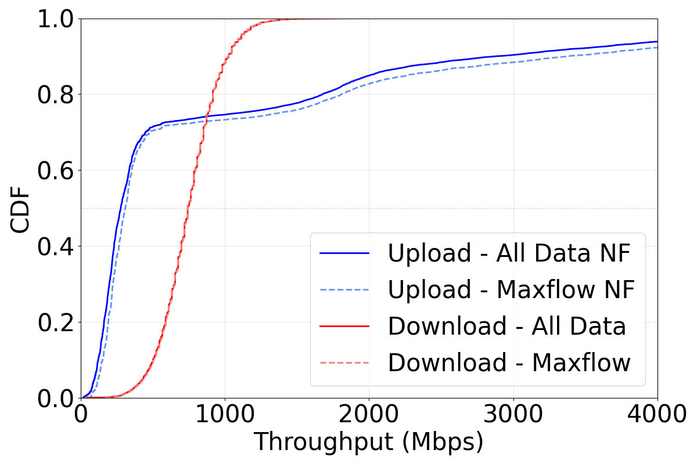
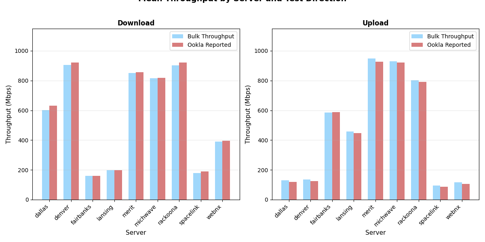
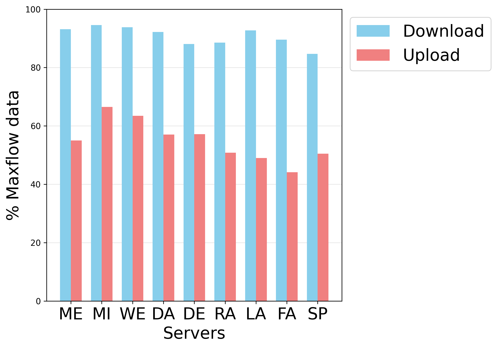
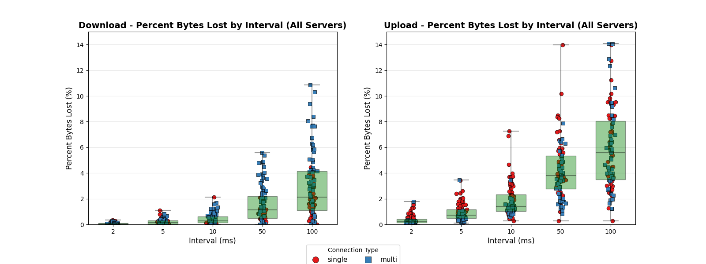

# Ookla Comparative Analysis Scripts

This subdirectory contains python scripts used for performing a comparative analysis of data across multiple speed tests.

# 1. Combining Data

The Python script `aggregation-scripts/combine_metrics.py` is designed to combine speed test metrics from multiple test directories. The data extracted from each test can be grouped into **TWO** classifications:

1) **Configuration Independent Data**: This is data that remains the same no matter what type of configurations we chose when modeling throughput. This data comes from `speedtest_result.json` (in test root) and `test_summary.json` (in upload/ and download/ directories), and uncludes metrics like the number of raw bytes, the latency values, and the bulk throughput.

2) **Configuration Dependent Data**: This is the data that depends on the various configurations (the bin size, data selection, artifact filtering, and eventually the slow start filtering). This data comes from the `configuration_data.csv` files from `upload/` and `download/` directories.

In order to perform this aggregation, each test must be processed and have this structure:

```
test-directory/
├── speedtest_result.json        # Shared by both phases
├── download/
│   ├── test_summary.json        # Download-specific summary
│   └── configuration_data.csv   # Download configuration results
└── upload/
    ├── test_summary.json        # Upload-specific summary
    └── configuration_data.csv   # Upload configuration results
```

### Aggregation Usage
```bash
python3 combine_metrics.py -t <target_dir> -o <output_dir> [options]
```
To support maximium configurability, there are a number of additional options to filter based on the specific type/number of tests.

All options can be shown using:

```bash
python3 combine_metrics.py -h
```

#### Required Arguments

- `-t, --target-dir`: Target directory to recursively search for tests. The recursive search is performed so the target directory could be a specific batch, multiple batches, or entirely different sets of tests.
- `-o, --output-dir`: Output directory where combined CSV files will be saved. There is no default set, but it is best practice to place in the `datasets/` directory.

### Optional Arguments

- `-m, --data-mode`: Type of data to combine
  - `independent`: Only combine speedtest_result.json and test_summary.json
  - `dependent`: Only combine configuration_data.csv files
  - `both`: Aggregate all data types (default)

- `-f, --flow-type`: Filter tests by flow type
  - `single`: Only process single-flow tests
  - `multi`: Only process multi-flow tests
  - `both`: Process all tests (default)

- `-p, --test-phase`: Filter by test phase
  - `download`: Only process download data
  - `upload`: Only process upload data
  - `both`: Process both phases (default)

## Output Files

### Configuration-Independent Data
- **File**: `combined_independent_data.csv`
- **Content**: One row per test phase (download or upload) per test
- **Columns**:
  - Test identifiers: `test_directory`, `test_name`, `timestamp`
  - Server info: `server_name`
  - System info: `os_type`, `chrome_version`
  - Test phase: `test_phase` (download/upload)
  - Speedtest metrics:
    - `ping_latency`, `download_latency` or `upload_latency`
    - `ookla_download_speed` or `ookla_upload_speed`
  - Summary metrics from test_summary.json:
    - `duration_ms`, `total_bytes`, `total_raw_bytes`, `total_processed_bytes`
    - `percent_byte_loss`, `total_http_streams`, `num_sockets`
    - `num_points_all_flows_contributing`, `percent_bytes_all_flows_contributing`, `percent_time_all_flows_contributing`

### Configuration-Dependent Data
- **Files**:
  - `combined_download_configuration_data.csv`
  - `combined_upload_configuration_data.csv`
- **Content**: All rows from individual `configuration_data.csv` files, with added identifiers
- **Additional Columns Added**:
  - `test_directory`, `test_name`, `server_name`
  - `timestamp`, `os_type`, `chrome_version`, `test_phase`
  -t /mnt/d/usa-server-tests/usa_ookla_tests_batch2_2026-02-06_0105 \
  -o ./output \
  -f multi
```

### Aggregate only independent data from download tests

```bash
python combine_metrics.py -t /mnt/d/usa-server-tests  -o ./csvs -m independent -p download
```

### Aggregate only configuration-dependent data from single-flow tests
```bash
python combine_metrics.py \
  -t /path/to/tests \
  -o ./csvs \
  -m dependent \
  -f single
```

### Aggregate all data types from a specific batch
```bash
python combine_metrics.py \
  -t /mnt/d/usa-server-tests/specific_batch \
  -o ./batch_results
```

## Error Handling

The script includes comprehensive error handling:

- **Missing Files**: Tests with missing required files are logged as failed
- **Invalid JSON**: Tests with corrupted JSON files are logged as failed
- **Missing CSV**: Tests without configuration_data.csv are handled gracefully
- **Summary Report**: At the end, a summary shows:
  - Total successful tests
  - Total failed tests
  - Details of each failed test with specific error messages

## Test Discovery

The script recursively searches the target directory for all subdirectories containing `speedtest_result.json`. It then:

1. Filters tests based on the flow type (single/multi) by checking the directory name
2. Processes each matching test directory
3. Aggregates data according to the specified mode and phase filters

## Notes

- The script skips processing if required files don't exist, but continues with other tests
- When aggregating configuration-dependent data, the script adds test identifiers to every row
- All paths in the output CSVs are absolute paths for easy tracking
- The script creates the output directory if it doesn't exist

# 2. Data Aggregation

The `aggregation-scripts/aggregate_speedtest_metrics.py` script is used to compute the mean and median values of the following values:

- Ping Latency
- Upload Latency
- Download Latency
- Upload Throughput
- Download Throughput

For example, if there are ten Michwave multi flow tests, it will compute the mean of all these values across all ten tests.

# 3. Comparative Statistics

KS best fit values are currently generated using the script `generate_best_fit_values.py`.

# 4. Comparative Plots

## Cumulative Density Function (CDF) Plot of Throughput Points



`python3 plot_throughput_cdf.py <target directory> [options]`

Options:
  -h, --help  show this help message and exit
  --bin BIN   Bin size for aggregating data (default: 1ms)
  --save      Save plot to plot_images directory

This plot is used to generate a CDF of the throughput values. Currently, the different configurations (max flow vs all data and artifact filter) are hardcoded! This needs to be fixed. The bin size is the only configuration that is adjustable. This plot calls `main.py` in the `single-test-analyis/` directory.

## Bulk vs Reported Throughput



`python3 plot_bulk_vs_reported_throughput.py ../../../datasets/aggregated_core_data.csv`

This plot shows the differences between the bulk throughput (sum of bytes/time) and the throughput value reported by Ookla.

## Average Maxflow Throughput



`python3 plot_average_throughput.py ../../../datasets/aggregated_core_data.csv`

This plot shows the average maxflow throughput, for each server and test direction.

## Percent of Bytes Lost Based on Bin Size



`python3 plot_bytes_lost_per_interval.py ../../../datasets/byte_loss.csv`

This plot shows the percent of bytes lost due to the bin size when we are only considering byte count events where all flows are contributing.
**Note** this plot was designed when we used the bin size as the *minimum threshold*. This method is NOT used, so this code is a bit stale.

